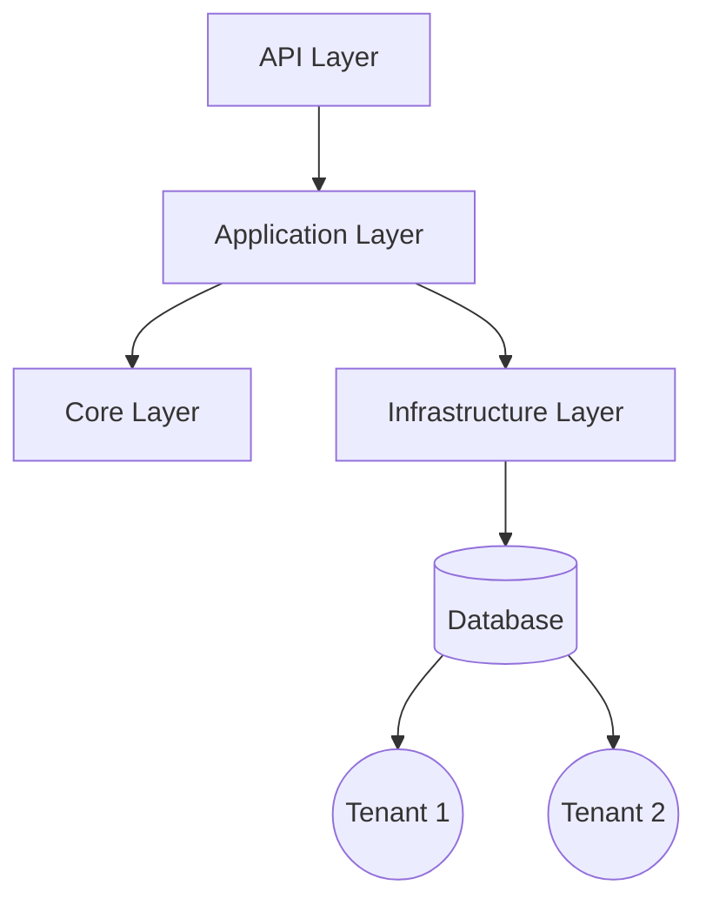

# Architecture



This project follows Clean Architecture principles:

- **Core**: Domain entities and interfaces (no dependencies)
- **Application**: Business logic, use cases, services
- **Infrastructure**: Data access (EF Core), external integrations
- **API**: ASP.NET Core Web API, DI, controllers

## Layered Dependencies
- API → Application → Core
- Infrastructure implements Core interfaces

## Multi-Tenancy
- Shared DB with tenant discriminator (default)
- Easily extendable to schema-per-tenant

## Project Structure
```
SaaS-MultiTenant-Starter/
  src/
    SaaS.MultiTenant.Core/
    SaaS.MultiTenant.Application/
    SaaS.MultiTenant.Infrastructure/
    SaaS.MultiTenant.API/
  tests/
  ci/
  docs/
``` 